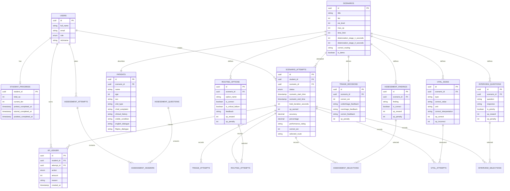

# TriageLearn ERD

```mermaid
erDiagram
  USERS ||--o| STUDENT_PROGRESS : has
  USERS ||--o{ ASSESSMENT_ATTEMPTS : takes
  ASSESSMENT_ATTEMPTS ||--o{ ASSESSMENT_ANSWERS : contains
  ASSESSMENT_QUESTIONS ||--o{ ASSESSMENT_ANSWERS : answers
  SCENARIOS ||--|| PATIENTS : describes
  SCENARIOS ||--o{ VITAL_SIGNS : defines
  SCENARIOS ||--o{ INTERVIEW_QUESTIONS : defines
  SCENARIOS ||--o{ ASSESSMENT_FINDINGS : defines
  SCENARIOS ||--|| TRIAGE_DECISIONS : defines
  SCENARIOS ||--o{ ROUTING_OPTIONS : defines
  USERS ||--o{ SCENARIO_ATTEMPTS : makes
  SCENARIOS ||--o{ SCENARIO_ATTEMPTS : attempted
  SCENARIO_ATTEMPTS ||--o{ INTERVIEW_SELECTIONS : records
  INTERVIEW_QUESTIONS ||--o{ INTERVIEW_SELECTIONS : selected
  SCENARIO_ATTEMPTS ||--o{ VITAL_ATTEMPTS : records
  VITAL_SIGNS ||--o{ VITAL_ATTEMPTS : measured
  SCENARIO_ATTEMPTS ||--o{ ASSESSMENT_SELECTIONS : records
  ASSESSMENT_FINDINGS ||--o{ ASSESSMENT_SELECTIONS : selected
  SCENARIO_ATTEMPTS ||--o{ TRIAGE_ATTEMPTS : records
  SCENARIO_ATTEMPTS ||--o{ ROUTING_ATTEMPTS : records
  ROUTING_OPTIONS ||--o{ ROUTING_ATTEMPTS : selected
  USERS ||--o{ XP_LEDGER : earns
  SCENARIO_ATTEMPTS ||--o{ XP_LEDGER : causes

  USERS { uuid id PK string full_name string email enum role string nickname }
  STUDENT_PROGRESS { uuid student_id PK int total_xp int current_tier timestamp pretest_completed_at timestamp tutorial_completed_at timestamp posttest_completed_at }
  SCENARIOS { uuid id PK string title int tier int esi_level int max_xp int time_limit int deterioration_stage_1_seconds int deterioration_stage_2_seconds string correct_routing boolean is_demo }
  PATIENTS { uuid id PK uuid scenario_id FK string name int age string sex string visit_type string chief_complaint string clinical_history string visible_condition string english_dialogue string filipino_dialogue }
  VITAL_SIGNS { uuid id PK uuid scenario_id FK string type string correct_value string unit string correct_interpretation int xp_correct int xp_incorrect }
  INTERVIEW_QUESTIONS { uuid id PK uuid scenario_id FK string question string response boolean is_priority int xp_reward int xp_penalty }
  ASSESSMENT_FINDINGS { uuid id PK uuid scenario_id FK string finding boolean is_correct int xp_reward int xp_penalty }
  TRIAGE_DECISIONS { uuid id PK uuid scenario_id FK int correct_esi string undertriage_feedback string overtriage_feedback string correct_feedback int xp_penalty }
  ROUTING_OPTIONS { uuid id PK uuid scenario_id FK string option_name boolean is_correct boolean is_critical_failure string feedback int xp_reward int xp_penalty }
  SCENARIO_ATTEMPTS { uuid id PK uuid student_id FK uuid scenario_id FK enum status timestamp scenario_start_time timestamp scenario_end_time int total_duration_seconds int xp_earned decimal accuracy decimal percentage string performance_rating int correct_esi string selected_route }
  XP_LEDGER { uuid id PK uuid student_id FK uuid attempt_id FK enum action int amount string reason timestamp created_at }
```
